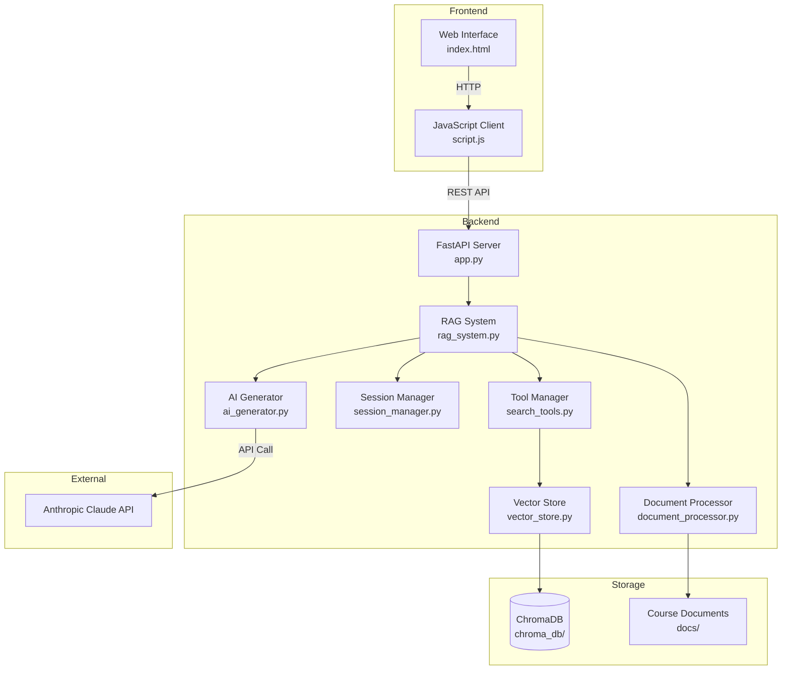
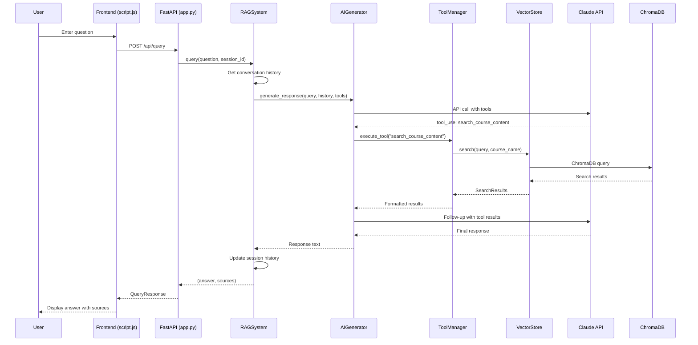
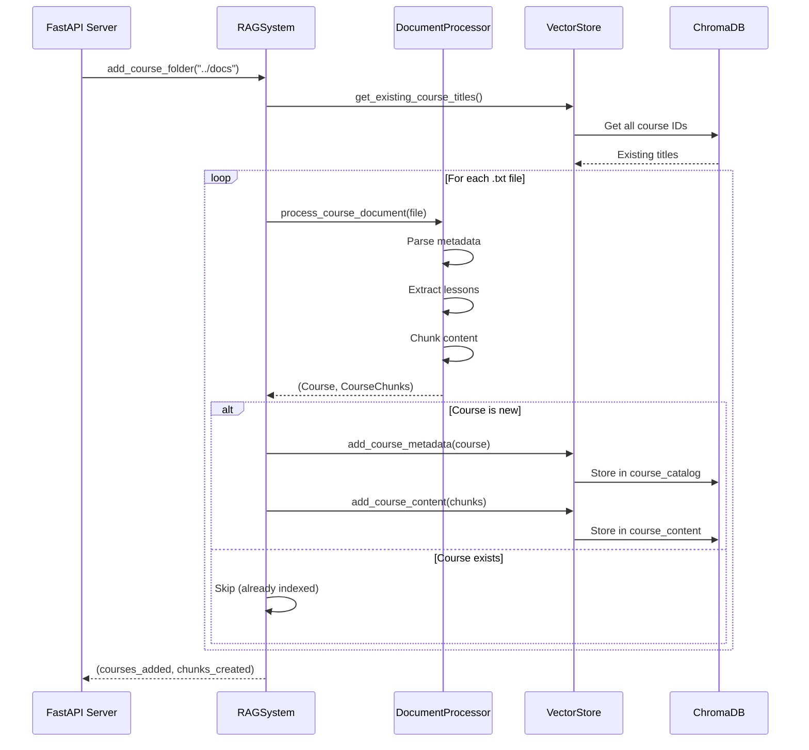
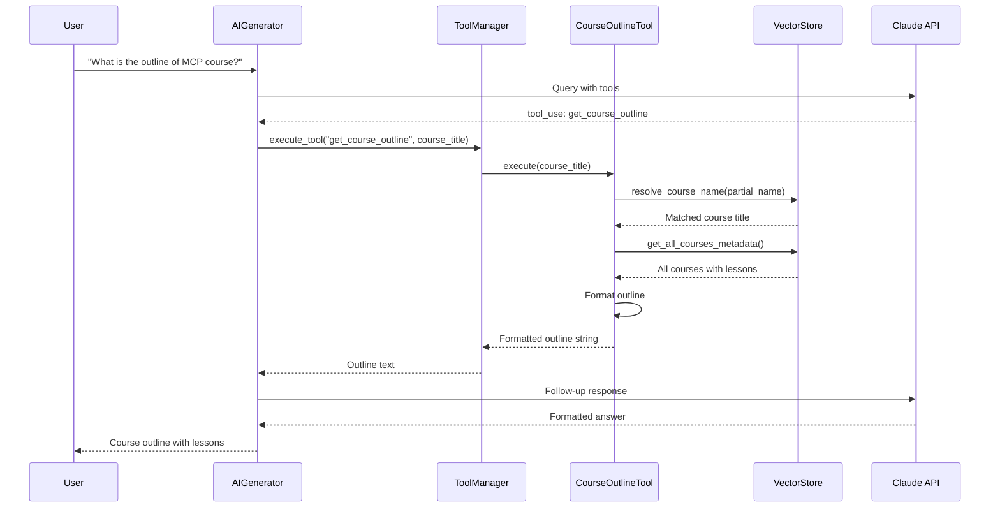

# Course Materials RAG System - Developer Onboarding

> A Retrieval-Augmented Generation (RAG) system for querying course materials using semantic search and AI-powered responses.

---

## 1. Overview

### Purpose
The Course Materials RAG System is a full-stack web application that enables users to query course materials and receive intelligent, context-aware responses. It combines semantic search capabilities with Claude AI to provide accurate answers based on indexed course content.

### Key Features
- **Semantic Search**: Query course content using natural language
- **AI-Powered Responses**: Claude AI generates contextual answers based on retrieved content
- **Course Outline Retrieval**: Get structured outlines of any indexed course
- **Session Management**: Maintains conversation context across multiple queries
- **Web Interface**: Clean, responsive chat interface for interacting with the system

### Technology Stack
| Category | Technology |
|----------|------------|
| **Backend** | Python 3.13+, FastAPI, Uvicorn |
| **AI/ML** | Anthropic Claude (claude-sonnet-4-20250514), Sentence Transformers |
| **Vector Database** | ChromaDB |
| **Frontend** | HTML5, CSS3, Vanilla JavaScript |
| **Package Manager** | uv |

---

## 2. High-Level Architecture Diagram



### Component Summary

| Component | Description |
|-----------|-------------|
| **Web Interface** | Static HTML/CSS/JS frontend providing a chat-based UI for user interaction |
| **FastAPI Server** | REST API server handling HTTP requests, serving static files, and routing to RAG system |
| **RAG System** | Central orchestrator connecting all components: document processing, vector search, AI generation, and session management |
| **AI Generator** | Interfaces with Anthropic's Claude API for generating intelligent responses with tool support |
| **Document Processor** | Parses course documents, extracts metadata, and chunks content for vector storage |
| **Vector Store** | ChromaDB wrapper for semantic search across course catalog and content |
| **Session Manager** | Maintains conversation history per user session |
| **Tool Manager** | Provides AI tools for course search and outline retrieval |

---

## 3. Component Breakdown

### Component: FastAPI Application

**File**: [app.py](/Users/mehta/Development/starting-ragchatbot-codebase/backend/app.py)

**Purpose**: HTTP server that exposes REST API endpoints and serves the frontend static files.

**Key Elements**:
- [`QueryRequest`](/Users/mehta/Development/starting-ragchatbot-codebase/backend/app.py#L38) - Pydantic model for query requests with `query` and optional `session_id`
- [`QueryResponse`](/Users/mehta/Development/starting-ragchatbot-codebase/backend/app.py#L43) - Response model containing `answer`, `sources`, and `session_id`
- [`POST /api/query`](/Users/mehta/Development/starting-ragchatbot-codebase/backend/app.py#L56) - Main endpoint for processing user queries
- [`GET /api/courses`](/Users/mehta/Development/starting-ragchatbot-codebase/backend/app.py#L76) - Returns course catalog statistics
- [`POST /api/session/new`](/Users/mehta/Development/starting-ragchatbot-codebase/backend/app.py#L88) - Creates new conversation session
- [`startup_event()`](/Users/mehta/Development/starting-ragchatbot-codebase/backend/app.py#L97) - Loads documents from `docs/` on startup

**Depends On**:
- Internal: `RAGSystem`, `Config`
- External: `fastapi`, `pydantic`, `uvicorn`

---

### Component: RAG System

**File**: [rag_system.py](/Users/mehta/Development/starting-ragchatbot-codebase/backend/rag_system.py)

**Purpose**: Central orchestrator that coordinates all RAG components to process queries and manage course documents.

**Key Elements**:
- [`RAGSystem.__init__()`](/Users/mehta/Development/starting-ragchatbot-codebase/backend/rag_system.py#L13) - Initializes all core components
- [`add_course_document()`](/Users/mehta/Development/starting-ragchatbot-codebase/backend/rag_system.py#L29) - Processes and indexes a single course file
- [`add_course_folder()`](/Users/mehta/Development/starting-ragchatbot-codebase/backend/rag_system.py#L54) - Batch processes all courses in a directory
- [`query()`](/Users/mehta/Development/starting-ragchatbot-codebase/backend/rag_system.py#L104) - Main entry point for processing user queries with AI and tools
- [`get_course_analytics()`](/Users/mehta/Development/starting-ragchatbot-codebase/backend/rag_system.py#L144) - Returns course catalog statistics

**Depends On**:
- Internal: `DocumentProcessor`, `VectorStore`, `AIGenerator`, `SessionManager`, `ToolManager`
- External: None

---

### Component: AI Generator

**File**: [ai_generator.py](/Users/mehta/Development/starting-ragchatbot-codebase/backend/ai_generator.py)

**Purpose**: Handles all interactions with Anthropic's Claude API, including tool calling for search operations.

**Key Elements**:
- [`SYSTEM_PROMPT`](/Users/mehta/Development/starting-ragchatbot-codebase/backend/ai_generator.py#L8) - Static prompt defining AI behavior for course queries
- [`generate_response()`](/Users/mehta/Development/starting-ragchatbot-codebase/backend/ai_generator.py#L52) - Main method for generating AI responses with optional tools
- [`_handle_tool_execution()`](/Users/mehta/Development/starting-ragchatbot-codebase/backend/ai_generator.py#L115) - Executes tool calls and retrieves follow-up responses

**Depends On**:
- Internal: None
- External: `anthropic`

---

### Component: Vector Store

**File**: [vector_store.py](/Users/mehta/Development/starting-ragchatbot-codebase/backend/vector_store.py)

**Purpose**: Manages ChromaDB collections for semantic search across course metadata and content.

**Key Elements**:
- [`SearchResults`](/Users/mehta/Development/starting-ragchatbot-codebase/backend/vector_store.py#L8) - Dataclass container for search results with metadata
- [`VectorStore.__init__()`](/Users/mehta/Development/starting-ragchatbot-codebase/backend/vector_store.py#L37) - Initializes ChromaDB client and collections
- [`search()`](/Users/mehta/Development/starting-ragchatbot-codebase/backend/vector_store.py#L61) - Main search interface with course/lesson filtering
- [`add_course_metadata()`](/Users/mehta/Development/starting-ragchatbot-codebase/backend/vector_store.py#L135) - Adds course to catalog collection
- [`add_course_content()`](/Users/mehta/Development/starting-ragchatbot-codebase/backend/vector_store.py#L162) - Adds content chunks to content collection
- [`_resolve_course_name()`](/Users/mehta/Development/starting-ragchatbot-codebase/backend/vector_store.py#L102) - Semantic matching for partial course names

**Collections**:
- `course_catalog` - Stores course titles, instructors, links, and lesson metadata
- `course_content` - Stores chunked course content for semantic search

**Depends On**:
- Internal: `Course`, `CourseChunk` models
- External: `chromadb`, `sentence-transformers`

---

### Component: Document Processor

**File**: [document_processor.py](/Users/mehta/Development/starting-ragchatbot-codebase/backend/document_processor.py)

**Purpose**: Parses course document files, extracts structured metadata (title, instructor, lessons), and chunks content for vector storage.

**Key Elements**:
- [`chunk_text()`](/Users/mehta/Development/starting-ragchatbot-codebase/backend/document_processor.py#L25) - Splits text into sentence-based chunks with configurable overlap
- [`process_course_document()`](/Users/mehta/Development/starting-ragchatbot-codebase/backend/document_processor.py#L97) - Main method that parses course files and returns structured data

**Expected Document Format**:
```
Course Title: [title]
Course Link: [url]
Course Instructor: [instructor]

Lesson 0: Introduction
Lesson Link: [url]
[content...]

Lesson 1: Getting Started
Lesson Link: [url]
[content...]
```

**Depends On**:
- Internal: `Course`, `Lesson`, `CourseChunk` models
- External: `os`, `re`

---

### Component: Session Manager

**File**: [session_manager.py](/Users/mehta/Development/starting-ragchatbot-codebase/backend/session_manager.py)

**Purpose**: Manages conversation sessions and message history for context-aware responses.

**Key Elements**:
- [`Message`](/Users/mehta/Development/starting-ragchatbot-codebase/backend/session_manager.py#L4) - Dataclass representing a single message (role + content)
- [`create_session()`](/Users/mehta/Development/starting-ragchatbot-codebase/backend/session_manager.py#L18) - Creates new session with unique ID
- [`add_exchange()`](/Users/mehta/Development/starting-ragchatbot-codebase/backend/session_manager.py#L37) - Adds user-assistant message pair
- [`get_conversation_history()`](/Users/mehta/Development/starting-ragchatbot-codebase/backend/session_manager.py#L42) - Retrieves formatted history for AI context

**Depends On**:
- Internal: None
- External: None

---

### Component: Search Tools

**File**: [search_tools.py](/Users/mehta/Development/starting-ragchatbot-codebase/backend/search_tools.py)

**Purpose**: Provides AI-callable tools for searching course content and retrieving course outlines.

**Key Elements**:
- [`Tool`](/Users/mehta/Development/starting-ragchatbot-codebase/backend/search_tools.py#L6) - Abstract base class for all tools
- [`CourseSearchTool`](/Users/mehta/Development/starting-ragchatbot-codebase/backend/search_tools.py#L20) - Semantic search with course/lesson filtering
- [`CourseOutlineTool`](/Users/mehta/Development/starting-ragchatbot-codebase/backend/search_tools.py#L124) - Retrieves complete course structure
- [`ToolManager`](/Users/mehta/Development/starting-ragchatbot-codebase/backend/search_tools.py#L198) - Registry and executor for all tools

**Tool Definitions** (Anthropic format):
1. `search_course_content` - Query parameter with optional course_name and lesson_number filters
2. `get_course_outline` - Course title parameter for outline retrieval

**Depends On**:
- Internal: `VectorStore`
- External: None

---

### Component: Data Models

**File**: [models.py](/Users/mehta/Development/starting-ragchatbot-codebase/backend/models.py)

**Purpose**: Pydantic models defining the core data structures used throughout the application.

**Key Elements**:
- [`Lesson`](/Users/mehta/Development/starting-ragchatbot-codebase/backend/models.py#L4) - Represents a lesson with number, title, and optional link
- [`Course`](/Users/mehta/Development/starting-ragchatbot-codebase/backend/models.py#L10) - Represents a course with title, link, instructor, and lessons
- [`CourseChunk`](/Users/mehta/Development/starting-ragchatbot-codebase/backend/models.py#L17) - Represents a text chunk for vector storage

**Depends On**:
- Internal: None
- External: `pydantic`

---

### Component: Configuration

**File**: [config.py](/Users/mehta/Development/starting-ragchatbot-codebase/backend/config.py)

**Purpose**: Centralized configuration management using dataclass with environment variable support.

**Key Settings**:
| Setting | Default | Description |
|---------|---------|-------------|
| `ANTHROPIC_API_KEY` | env var | API key for Claude |
| `ANTHROPIC_MODEL` | claude-sonnet-4-20250514 | Claude model to use |
| `EMBEDDING_MODEL` | all-MiniLM-L6-v2 | Sentence transformer model |
| `CHUNK_SIZE` | 800 | Characters per chunk |
| `CHUNK_OVERLAP` | 100 | Overlap between chunks |
| `MAX_RESULTS` | 5 | Max search results |
| `MAX_HISTORY` | 2 | Conversation messages to remember |
| `CHROMA_PATH` | ./chroma_db | ChromaDB storage path |

**Depends On**:
- Internal: None
- External: `python-dotenv`

---

### Component: Frontend

**Files**:
- [index.html](/Users/mehta/Development/starting-ragchatbot-codebase/frontend/index.html)
- [script.js](/Users/mehta/Development/starting-ragchatbot-codebase/frontend/script.js)
- [style.css](/Users/mehta/Development/starting-ragchatbot-codebase/frontend/style.css)

**Purpose**: Web-based chat interface for interacting with the RAG system.

**Key Elements**:
- Chat message display with markdown rendering (via `marked.js`)
- Collapsible sidebar with course stats and suggested questions
- Session management (new chat creation)
- Loading states and error handling

**API Calls**:
- `POST /api/query` - Send user queries
- `GET /api/courses` - Load course statistics
- `POST /api/session/new` - Create new session

**Depends On**:
- Internal: Backend API
- External: `marked.js` (CDN)

---

## 4. Data Flow & Call Flow Examples

### Example Flow: User Query Processing

**Description**: User submits a question through the chat interface, which is processed by the RAG system using AI with tool-based search.



**Key Files**: [script.js](/Users/mehta/Development/starting-ragchatbot-codebase/frontend/script.js), [app.py](/Users/mehta/Development/starting-ragchatbot-codebase/backend/app.py), [rag_system.py](/Users/mehta/Development/starting-ragchatbot-codebase/backend/rag_system.py), [ai_generator.py](/Users/mehta/Development/starting-ragchatbot-codebase/backend/ai_generator.py), [search_tools.py](/Users/mehta/Development/starting-ragchatbot-codebase/backend/search_tools.py), [vector_store.py](/Users/mehta/Development/starting-ragchatbot-codebase/backend/vector_store.py)

---

### Example Flow: Document Ingestion on Startup

**Description**: When the server starts, it automatically loads and indexes all course documents from the `docs/` folder.



**Key Files**: [app.py](/Users/mehta/Development/starting-ragchatbot-codebase/backend/app.py#L97), [rag_system.py](/Users/mehta/Development/starting-ragchatbot-codebase/backend/rag_system.py#L54), [document_processor.py](/Users/mehta/Development/starting-ragchatbot-codebase/backend/document_processor.py#L97), [vector_store.py](/Users/mehta/Development/starting-ragchatbot-codebase/backend/vector_store.py)

---

### Example Flow: Course Outline Retrieval

**Description**: User asks for a course outline, triggering the outline tool instead of content search.



**Key Files**: [ai_generator.py](/Users/mehta/Development/starting-ragchatbot-codebase/backend/ai_generator.py), [search_tools.py](/Users/mehta/Development/starting-ragchatbot-codebase/backend/search_tools.py#L124), [vector_store.py](/Users/mehta/Development/starting-ragchatbot-codebase/backend/vector_store.py)

---

## 5. Data Models (Entities)

### Entity: [Course](/Users/mehta/Development/starting-ragchatbot-codebase/backend/models.py#L10)

- **Purpose**: Represents a complete course with metadata and lessons
- **Fields**:
  - `title: str` - Course title (unique identifier)
  - `course_link: Optional[str]` - URL link to the course
  - `instructor: Optional[str]` - Course instructor name
  - `lessons: List[Lesson]` - List of lessons in this course
- **Storage**: Stored in `course_catalog` ChromaDB collection with lessons serialized as JSON

---

### Entity: [Lesson](/Users/mehta/Development/starting-ragchatbot-codebase/backend/models.py#L4)

- **Purpose**: Represents a single lesson within a course
- **Fields**:
  - `lesson_number: int` - Sequential lesson number (0, 1, 2, etc.)
  - `title: str` - Lesson title
  - `lesson_link: Optional[str]` - URL link to the lesson
- **Storage**: Serialized as JSON within course metadata

---

### Entity: [CourseChunk](/Users/mehta/Development/starting-ragchatbot-codebase/backend/models.py#L17)

- **Purpose**: Represents a text chunk from course content for vector storage
- **Fields**:
  - `content: str` - The actual text content (with lesson context prefix)
  - `course_title: str` - Which course this chunk belongs to
  - `lesson_number: Optional[int]` - Which lesson this chunk is from
  - `chunk_index: int` - Position of this chunk in the document
- **Storage**: Stored in `course_content` ChromaDB collection with embeddings

---

### Entity: [Message](/Users/mehta/Development/starting-ragchatbot-codebase/backend/session_manager.py#L4)

- **Purpose**: Represents a single message in a conversation session
- **Fields**:
  - `role: str` - "user" or "assistant"
  - `content: str` - The message content
- **Storage**: In-memory dictionary keyed by session ID

---

### Entity: [SearchResults](/Users/mehta/Development/starting-ragchatbot-codebase/backend/vector_store.py#L8)

- **Purpose**: Container for ChromaDB search results
- **Fields**:
  - `documents: List[str]` - Retrieved document texts
  - `metadata: List[Dict]` - Associated metadata
  - `distances: List[float]` - Similarity scores
  - `error: Optional[str]` - Error message if search failed
- **Storage**: Transient (created per search operation)

---

## 6. Quick Start Guide

### Prerequisites
- Python 3.13+
- uv package manager
- Anthropic API key

### Installation

```bash
# Install uv (if needed)
curl -LsSf https://astral.sh/uv/install.sh | sh

# Install dependencies
uv sync

# Create .env file
echo "ANTHROPIC_API_KEY=your_key_here" > .env
```

### Running the Application

```bash
# Using the run script
./run.sh

# Or manually
cd backend && uv run uvicorn app:app --reload --port 8000
```

Access the application at `http://localhost:8000`

### Adding Course Documents

Place `.txt` files in the `docs/` folder following this format:

```
Course Title: My Course Title
Course Link: https://example.com/course
Course Instructor: John Doe

Lesson 0: Introduction
Lesson Link: https://example.com/lesson0
[Lesson content here...]

Lesson 1: Getting Started
Lesson Link: https://example.com/lesson1
[Lesson content here...]
```

Documents are automatically indexed on server startup.

---

## 7. Directory Structure

```
starting-ragchatbot-codebase/
├── backend/
│   ├── app.py              # FastAPI server and endpoints
│   ├── rag_system.py       # Main orchestrator
│   ├── ai_generator.py     # Claude API integration
│   ├── vector_store.py     # ChromaDB operations
│   ├── document_processor.py # Document parsing
│   ├── session_manager.py  # Session handling
│   ├── search_tools.py     # AI tool definitions
│   ├── models.py           # Pydantic data models
│   ├── config.py           # Configuration
│   ├── chroma_db/          # ChromaDB storage
│   └── tests/              # Test files
├── frontend/
│   ├── index.html          # Main HTML page
│   ├── script.js           # Frontend JavaScript
│   └── style.css           # Styling
├── docs/                   # Course documents (input)
├── main.py                 # Entry point (unused)
├── run.sh                  # Startup script
├── pyproject.toml          # Project dependencies
└── uv.lock                 # Dependency lock file
```

---

## 8. Testing

```bash
cd backend
uv run pytest tests/ -v
```

Test files:
- [test_ai_generator.py](/Users/mehta/Development/starting-ragchatbot-codebase/backend/tests/test_ai_generator.py)
- [test_rag_system.py](/Users/mehta/Development/starting-ragchatbot-codebase/backend/tests/test_rag_system.py)
- [test_course_search_tool.py](/Users/mehta/Development/starting-ragchatbot-codebase/backend/tests/test_course_search_tool.py)

---

*Generated by Devmate*
