# User Query Flow Visualization

> Complete journey of a user query from frontend input to AI-powered response

---

## Flow Diagram

```mermaid
flowchart TB
    subgraph USER [" 👤 USER "]
        U1[/"Type question in chat"/]
        U2[/"View answer with sources"/]
    end

    subgraph FRONTEND ["🌐 FRONTEND"]
        direction TB
        F1["📝 Capture input<br/><i>script.js</i>"]
        F2["📤 POST /api/query<br/><i>fetch() with session_id</i>"]
        F3["⏳ Show loading animation"]
        F4["✨ Render markdown response<br/><i>marked.js</i>"]
        F5["📎 Display collapsible sources"]
    end

    subgraph API ["⚡ FASTAPI SERVER"]
        direction TB
        A1["🔍 Validate request<br/><i>QueryRequest model</i>"]
        A2["📞 Call RAG system<br/><i>rag_system.query()</i>"]
        A3["📦 Format response<br/><i>QueryResponse model</i>"]
    end

    subgraph RAG ["🧠 RAG SYSTEM"]
        direction TB
        R1["🕐 Get session history<br/><i>session_manager</i>"]
        R2["🔧 Prepare tools<br/><i>tool_manager</i>"]
        R3["🤖 Generate response<br/><i>ai_generator</i>"]
        R4["💾 Update history<br/><i>add_exchange()</i>"]
        R5["📋 Extract sources"]
    end

    subgraph AI ["🤖 AI GENERATOR"]
        direction TB
        AI1["📝 Build system prompt<br/><i>+ conversation context</i>"]
        AI2["🌐 Call Claude API<br/><i>anthropic.messages.create()</i>"]
        AI3{"🔀 Tool use<br/>requested?"}
        AI4["⚙️ Execute tool<br/><i>tool_manager.execute_tool()</i>"]
        AI5["🔄 Follow-up call<br/><i>with tool results</i>"]
        AI6["✅ Return final text"]
    end

    subgraph TOOLS ["🔧 SEARCH TOOLS"]
        direction TB
        T1{"🎯 Which tool?"}
        T2["🔍 CourseSearchTool<br/><i>Semantic content search</i>"]
        T3["📑 CourseOutlineTool<br/><i>Course structure lookup</i>"]
    end

    subgraph VECTOR ["💾 VECTOR STORE"]
        direction TB
        V1["🎯 Resolve course name<br/><i>semantic matching</i>"]
        V2["🔎 Query ChromaDB<br/><i>course_content collection</i>"]
        V3["📊 Format results<br/><i>SearchResults object</i>"]
    end

    subgraph DB ["🗄️ CHROMADB"]
        direction TB
        D1[("course_catalog<br/><i>titles, instructors, lessons</i>")]
        D2[("course_content<br/><i>chunked text + embeddings</i>")]
    end

    subgraph CLAUDE ["☁️ CLAUDE API"]
        C1["🧠 Anthropic Claude<br/><i>claude-sonnet-4-20250514</i>"]
    end

    %% Main flow
    U1 --> F1
    F1 --> F2
    F2 --> F3
    F2 --> A1

    A1 --> A2
    A2 --> R1

    R1 --> R2
    R2 --> R3
    R3 --> AI1

    AI1 --> AI2
    AI2 --> C1
    C1 --> AI3

    AI3 -->|"Yes"| AI4
    AI3 -->|"No"| AI6

    AI4 --> T1
    T1 -->|"search_course_content"| T2
    T1 -->|"get_course_outline"| T3

    T2 --> V1
    T3 --> V1
    V1 --> D1
    V1 --> V2
    V2 --> D2
    D2 --> V3

    V3 --> AI5
    AI5 --> C1
    C1 --> AI6

    AI6 --> R4
    R4 --> R5
    R5 --> A3

    A3 --> F4
    F4 --> F5
    F5 --> U2

    %% Styling
    classDef userStyle fill:#10b981,stroke:#059669,color:#fff,stroke-width:2px
    classDef frontendStyle fill:#3b82f6,stroke:#2563eb,color:#fff,stroke-width:2px
    classDef apiStyle fill:#8b5cf6,stroke:#7c3aed,color:#fff,stroke-width:2px
    classDef ragStyle fill:#f59e0b,stroke:#d97706,color:#fff,stroke-width:2px
    classDef aiStyle fill:#ec4899,stroke:#db2777,color:#fff,stroke-width:2px
    classDef toolStyle fill:#14b8a6,stroke:#0d9488,color:#fff,stroke-width:2px
    classDef vectorStyle fill:#6366f1,stroke:#4f46e5,color:#fff,stroke-width:2px
    classDef dbStyle fill:#64748b,stroke:#475569,color:#fff,stroke-width:2px
    classDef claudeStyle fill:#d946ef,stroke:#c026d3,color:#fff,stroke-width:2px
    classDef decisionStyle fill:#fbbf24,stroke:#f59e0b,color:#000,stroke-width:2px

    class U1,U2 userStyle
    class F1,F2,F3,F4,F5 frontendStyle
    class A1,A2,A3 apiStyle
    class R1,R2,R3,R4,R5 ragStyle
    class AI1,AI2,AI4,AI5,AI6 aiStyle
    class AI3,T1 decisionStyle
    class T2,T3 toolStyle
    class V1,V2,V3 vectorStyle
    class D1,D2 dbStyle
    class C1 claudeStyle

    %% Click handlers for file navigation
    click F1 "/Users/mehta/Development/starting-ragchatbot-codebase/frontend/script.js" "Open script.js"
    click F2 "/Users/mehta/Development/starting-ragchatbot-codebase/frontend/script.js" "Open script.js"
    click F4 "/Users/mehta/Development/starting-ragchatbot-codebase/frontend/script.js" "Open script.js"
    click A1 "/Users/mehta/Development/starting-ragchatbot-codebase/backend/app.py" "Open app.py"
    click A2 "/Users/mehta/Development/starting-ragchatbot-codebase/backend/app.py" "Open app.py"
    click A3 "/Users/mehta/Development/starting-ragchatbot-codebase/backend/app.py" "Open app.py"
    click R1 "/Users/mehta/Development/starting-ragchatbot-codebase/backend/session_manager.py" "Open session_manager.py"
    click R2 "/Users/mehta/Development/starting-ragchatbot-codebase/backend/search_tools.py" "Open search_tools.py"
    click R3 "/Users/mehta/Development/starting-ragchatbot-codebase/backend/rag_system.py" "Open rag_system.py"
    click R4 "/Users/mehta/Development/starting-ragchatbot-codebase/backend/session_manager.py" "Open session_manager.py"
    click AI1 "/Users/mehta/Development/starting-ragchatbot-codebase/backend/ai_generator.py" "Open ai_generator.py"
    click AI2 "/Users/mehta/Development/starting-ragchatbot-codebase/backend/ai_generator.py" "Open ai_generator.py"
    click AI4 "/Users/mehta/Development/starting-ragchatbot-codebase/backend/ai_generator.py" "Open ai_generator.py"
    click AI5 "/Users/mehta/Development/starting-ragchatbot-codebase/backend/ai_generator.py" "Open ai_generator.py"
    click T2 "/Users/mehta/Development/starting-ragchatbot-codebase/backend/search_tools.py" "Open search_tools.py"
    click T3 "/Users/mehta/Development/starting-ragchatbot-codebase/backend/search_tools.py" "Open search_tools.py"
    click V1 "/Users/mehta/Development/starting-ragchatbot-codebase/backend/vector_store.py" "Open vector_store.py"
    click V2 "/Users/mehta/Development/starting-ragchatbot-codebase/backend/vector_store.py" "Open vector_store.py"
    click V3 "/Users/mehta/Development/starting-ragchatbot-codebase/backend/vector_store.py" "Open vector_store.py"
```



---

## Step-by-Step Breakdown

### 1️⃣ User Input (Frontend)
| Step | Component | Action |
|------|-----------|--------|
| 1.1 | `index.html` | User types question in chat input field |
| 1.2 | `script.js` | `sendMessage()` captures input on Enter/click |
| 1.3 | `script.js` | Adds user message to chat, shows loading animation |
| 1.4 | `script.js` | `fetch()` sends POST to `/api/query` with `{query, session_id}` |

### 2️⃣ API Processing (FastAPI)
| Step | Component | Action |
|------|-----------|--------|
| 2.1 | `app.py` | `query_documents()` endpoint receives request |
| 2.2 | `app.py` | Validates via `QueryRequest` Pydantic model |
| 2.3 | `app.py` | Creates session if `session_id` is null |
| 2.4 | `app.py` | Calls `rag_system.query(query, session_id)` |

### 3️⃣ RAG Orchestration
| Step | Component | Action |
|------|-----------|--------|
| 3.1 | `rag_system.py` | Retrieves conversation history from `SessionManager` |
| 3.2 | `rag_system.py` | Gets tool definitions from `ToolManager` |
| 3.3 | `rag_system.py` | Calls `ai_generator.generate_response()` |

### 4️⃣ AI Generation
| Step | Component | Action |
|------|-----------|--------|
| 4.1 | `ai_generator.py` | Builds system prompt with conversation context |
| 4.2 | `ai_generator.py` | Calls Claude API with tools attached |
| 4.3 | Claude API | Analyzes query and decides tool usage |
| 4.4 | `ai_generator.py` | If tool requested → `_handle_tool_execution()` |

### 5️⃣ Tool Execution (if needed)
| Step | Component | Action |
|------|-----------|--------|
| 5.1 | `search_tools.py` | `ToolManager.execute_tool()` dispatches to correct tool |
| 5.2 | `CourseSearchTool` | Calls `VectorStore.search()` with filters |
| 5.3 | `vector_store.py` | Resolves course name via semantic matching |
| 5.4 | `vector_store.py` | Queries `course_content` collection in ChromaDB |
| 5.5 | `search_tools.py` | Formats results with course/lesson context |

### 6️⃣ Response Generation
| Step | Component | Action |
|------|-----------|--------|
| 6.1 | `ai_generator.py` | Sends tool results back to Claude |
| 6.2 | Claude API | Generates final answer using search context |
| 6.3 | `ai_generator.py` | Extracts text from response |

### 7️⃣ Response Return Path
| Step | Component | Action |
|------|-----------|--------|
| 7.1 | `rag_system.py` | Updates session history with exchange |
| 7.2 | `rag_system.py` | Extracts sources from `ToolManager` |
| 7.3 | `app.py` | Wraps in `QueryResponse` with answer, sources, session_id |
| 7.4 | `script.js` | Receives JSON response |
| 7.5 | `script.js` | Renders answer as markdown via `marked.js` |
| 7.6 | `script.js` | Displays collapsible sources with links |

---

## Data Payloads

### Request: Frontend → Backend
```json
{
  "query": "What is RAG?",
  "session_id": "session_1"
}
```

### Response: Backend → Frontend
```json
{
  "answer": "RAG (Retrieval-Augmented Generation) is...",
  "sources": [
    {
      "text": "Course Name - Lesson 1",
      "link": "https://example.com/lesson1"
    }
  ],
  "session_id": "session_1"
}
```

### Claude Tool Call
```json
{
  "type": "tool_use",
  "name": "search_course_content",
  "input": {
    "query": "What is RAG?",
    "course_name": null,
    "lesson_number": null
  }
}
```

---

## Key Files Reference

| Layer | File | Purpose |
|-------|------|---------|
| Frontend | [script.js](/Users/mehta/Development/starting-ragchatbot-codebase/frontend/script.js) | User interaction, API calls, rendering |
| API | [app.py](/Users/mehta/Development/starting-ragchatbot-codebase/backend/app.py) | HTTP endpoints, request validation |
| RAG | [rag_system.py](/Users/mehta/Development/starting-ragchatbot-codebase/backend/rag_system.py) | Orchestration of all components |
| AI | [ai_generator.py](/Users/mehta/Development/starting-ragchatbot-codebase/backend/ai_generator.py) | Claude API integration, tool handling |
| Tools | [search_tools.py](/Users/mehta/Development/starting-ragchatbot-codebase/backend/search_tools.py) | Search and outline tool implementations |
| Vector | [vector_store.py](/Users/mehta/Development/starting-ragchatbot-codebase/backend/vector_store.py) | ChromaDB operations, semantic search |
| Session | [session_manager.py](/Users/mehta/Development/starting-ragchatbot-codebase/backend/session_manager.py) | Conversation history management |

---

*Click on any node in the diagram to navigate to the source file*
